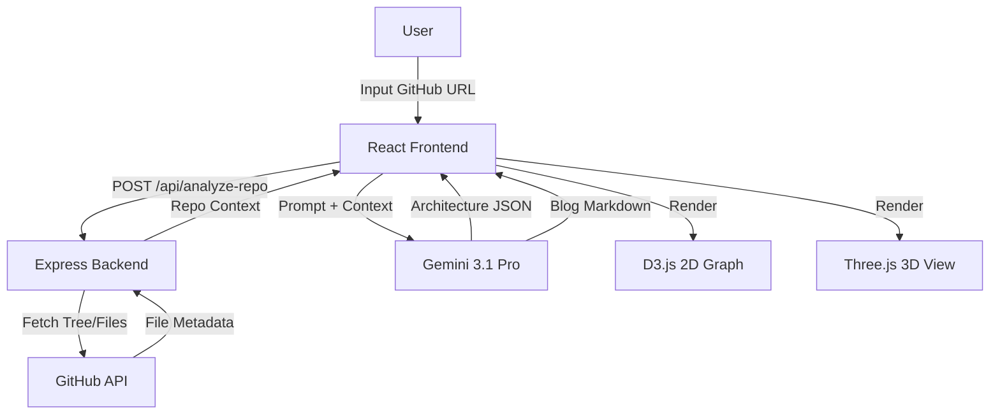

# ArchGen AI: GitHub Repo → Auto Architecture Generator

ArchGen AI is a production-ready web application that automatically analyzes GitHub repositories to generate interactive 2D and 3D architecture diagrams, along with detailed system design explanations.

## 🚀 Features

- **GitHub Integration**: Fetch and analyze any public repository using the GitHub API.
- **AI-Powered Analysis**: Uses Gemini 3.1 Pro to understand codebase structure, detect services, databases, and data flows.
- **2D Interactive Diagrams**: Dynamic force-directed graphs built with D3.js.
- **3D Interactive Visualization**: Immersive 3D component visualization built with Three.js and React Three Fiber.
- **Automated Documentation**: Generates professional blog-style system design explanations in Markdown.
- **Modern UI**: Clean, responsive dashboard built with React, Tailwind CSS, and Framer Motion.

## 🛠️ Tech Stack

- **Frontend**: React, Vite, Tailwind CSS, Framer Motion
- **Backend**: Node.js, Express (Full-stack setup)
- **AI**: Google Gemini 3.1 Pro SDK
- **Visualization**: D3.js, Three.js, React Three Fiber
- **Icons**: Lucide React

## 🏗️ Application Architecture



## ⚙️ DevOps & Deployment

This application is built with DevOps principles in mind:

- **Containerization**: A multi-stage `Dockerfile` is provided for efficient, production-ready container images.
- **CI/CD**: A GitHub Actions workflow (`.github/workflows/deploy.yml`) is included for automated linting, building, and deployment templates.
- **Infrastructure as Code**: Ready for deployment to platforms like Google Cloud Run or AWS App Runner.
- **Observability**: Includes a `/api/health` endpoint for health checks and monitoring.
- **Environment Management**: Uses `.env.example` for secure and transparent configuration.

### Local Development

1. Install dependencies: `npm install`
2. Set up environment variables in `.env`
3. Run dev server: `npm run dev`

### Production Build

```bash
# Build the application
npm run build

# Start the production server
npm start
```

## 📝 License

SPDX-License-Identifier: Apache-2.0
